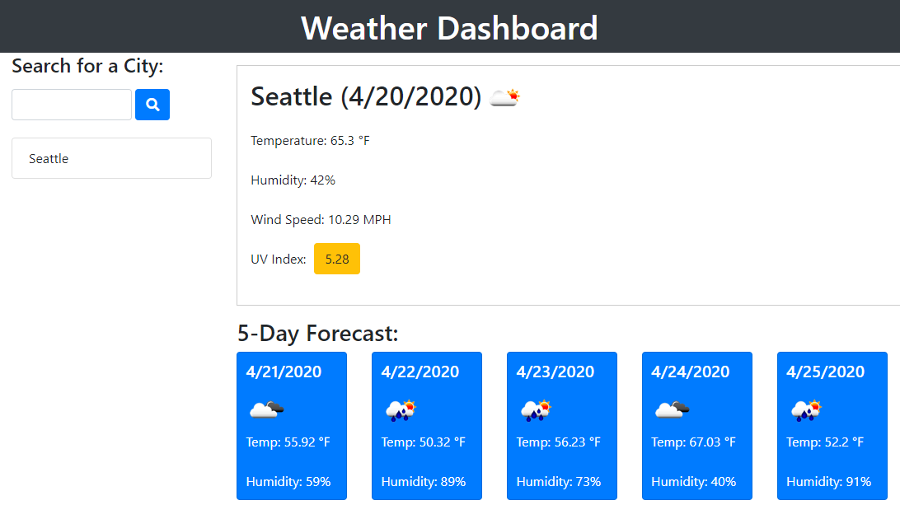
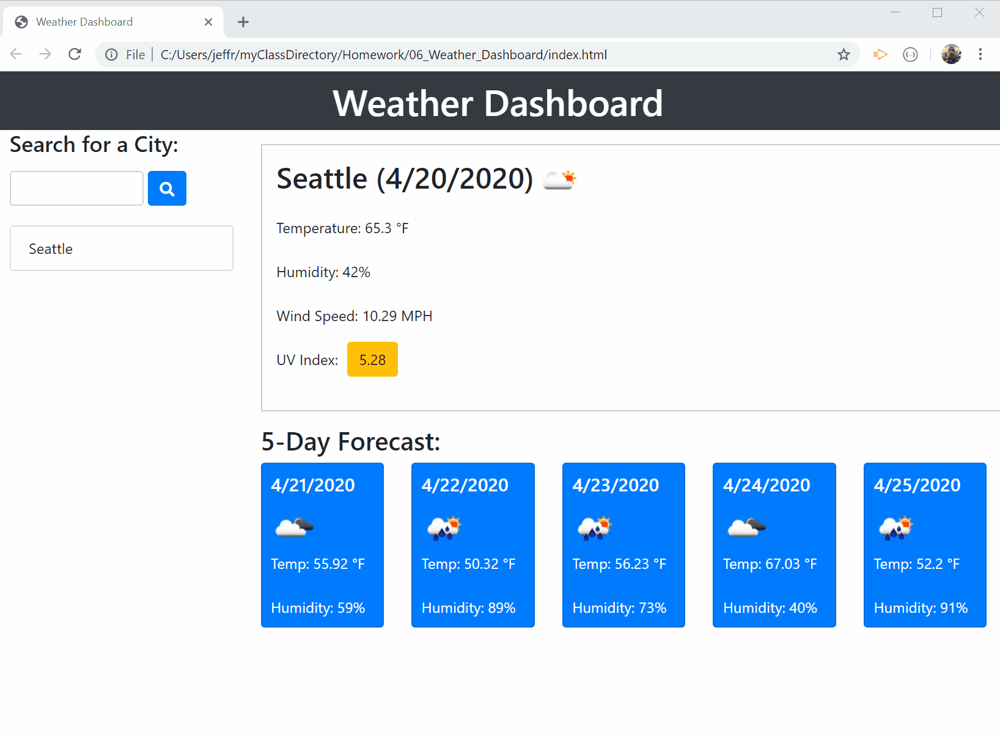

# 06 Server-Side APIs: Weather Dashboard

### Jeffrey Adamo  
UW Full Stack BootCamp  
Week 6 Homework: Server-Side APIs

## Objective

Utilize the third-party API, [OpenWeather API](https://openweathermap.org/api) to build a weather dashboard to retrive weather data for cities. The dashboard will run in the browser and feature dynamically updated HTML and CSS

CSS: [BootstrapCDN](https://stackpath.bootstrapcdn.com/bootstrap/4.4.1/css/bootstrap.min.css)

JQuery: [Cloundfare](https://cdnjs.cloudflare.com/ajax/libs/jquery/3.2.1/jquery.min.js)

Font: [FontAwesome](https://use.fontawesome.com/releases/v5.8.1/css/all.css)


## User Story

```
AS A traveler
I WANT to see the weather outlook for multiple cities
SO THAT I can plan a trip accordingly
```

## Demo:
* User is greeted with current weather conditions and forecast for Seattle




* Page has a simple navigation bar that says, "Weather Dashboard"
* Left aside contains search form and previously searched city
* Main section displays current weather for Seattle, with date, weather icon and then rows containing data for Temperature, Humidity, Wind Speed, and UV Index
* UV Index is color scaled based on severity
* 5-Day Forecast contains cards with date, weather icon, Temp, and Humidity


* When searching for a city, a new button for the searched city is prepended to the aside and when clicked on, will display city for that city again. When refreshed, the most recent searched city results will be displayed



## Acceptance Criteria

```
GIVEN a weather dashboard with form inputs
WHEN I search for a city
THEN I am presented with current and future conditions for that city and that city is added to the search history
WHEN I view current weather conditions for that city
THEN I am presented with the city name, the date, an icon representation of weather conditions, the temperature, the humidity, the wind speed, and the UV index
WHEN I view the UV index
THEN I am presented with a color that indicates whether the conditions are favorable, moderate, or severe
WHEN I view future weather conditions for that city
THEN I am presented with a 5-day forecast that displays the date, an icon representation of weather conditions, the temperature, and the humidity
WHEN I click on a city in the search history
THEN I am again presented with current and future conditions for that city
WHEN I open the weather dashboard
THEN I am presented with the last searched city forecast
```

## Development Notes:
```
GIVEN a weather dashboard with form inputs

```
### Pseudocoding:


Development began with a rough checklist of creating starting index.html, style.css, and script.js files and then setting references to OpenWeatherMaps and jQuery APIs, BootstrapCDN and FontAwesome CDN.

A sketch was made of how I may go about using Bootsraps grid system to set my columns in accordance to the design. 


Appears that Local Storage will be utilized and mulitple API calls may need to occur depending on which one is free, or requires more information to GET specific data.

The UV Index requires a color scale, so looking at what is current standards according to the EPA (https://www.epa.gov/sunsafety/uv-index-scale-0), rules will have be be set to apply different class colors.

## Features

User is greeted with a left aside element with a search form and the current weather data for Seattle. There are cards for a 5 days forecast and an aside with a search form. 
 
The formatting has BootstrapCDN components including a simple Navbar with page title. A container element holds a main element that uses column components to divide the page into 2 main columns at 3/12 & 9/12 size. 

```
WHEN I search for a city
```
The left aside column has search input from BootstrapCDN and search icon from www.fontawesome.com. The $(.button).on("click") function () event handler is listening to initiate an AJAX call to OpenWeatherMaps Current Weather data API. 

```javascript
//Write an onclick function to set the search form to the AJAX call:
$("#clickedButton").on("click", function(event) {
    event.preventDefault();
    console.log("click");
    var city = $("#citySearch").val();

    // To prevent from making an empty AJAX call, any clicks with no values in the search input shouldn't do anything; prevents from appending boxes on the left aside bar:
    if(city === ""){return}; //see Issue 1) below

    //Make a AJAX call using the defined variable "city"
    APIcall(city);
```

The current weather OWM API is called with a query URL incorporating the "city" variable:

```javascript
function APIcall(city){
    var currentqueryURL =
    "https://api.openweathermap.org/data/2.5/weather?q=" +
    city +
    "&units=imperial&appid=" +
    APIKey;

    //Setup AJAX call to OpenWeatherMaps Current Weather Data API:
    $.ajax({
    url: currentqueryURL,
    method: "GET",
    })
   
```


```
THEN I am presented with current and future conditions for that city and that city is added to the search history
```
Variables are defined out of the response locations for : city name, date, weather icon, temperature, humidity, and wind speed for this AJAX call. We also define variables for lattitude "lat" and longitude "lon" pulled from the response. To define UV Index we had to use another API:

```javascript
//UV Index requires a seperate AJAX query to OWM UV Index API:
    //Lattitude and Longitude of city required to make AJAX call to OWM's UV Index API
    var lat = responseNow.coord.lat;
    var lon = responseNow.coord.lon;
    console.log("Lat & Long is: " + lat + ", " + lon);

    var queryURLuv =
        "http://api.openweathermap.org/data/2.5/uvi?appid=" +
        APIKey +
        "&lat=" +
        lat +
        "&lon=" +
        lon;
    var uvIndex;
    $.ajax({
        url: queryURLuv,
        method: "GET",
    })
    .then(function (UVresponse) {
        uvIndex = UVresponse.value;
```

Another AJAX call to the OWM OneCall API will gather forecasted data:

```javascript
    var queryURL = "https://api.openweathermap.org/data/2.5/onecall?lat=" + lat + "&lon=" +lon+ "&units=imperial&appid="+ APIKey;
        //Setup AJAX call:
        $.ajax({
        url: queryURL,
        method: "GET",
        })
```

Too add the city to the search list we use the "city" variable defined in the onclick event:

```javascript
//Add a list group item with the recently searched city to the aside on the html
    $(".list-group").prepend("<li class='list-group-item searchedCities'>"+city+"</li>")
```

```
WHEN I view current weather conditions for that city
THEN I am presented with the city name, the date, an icon representation of weather conditions, the temperature, the humidity, the wind speed, and the UV index
```
Another onclick event is defined to make a call for the value of the city clicked:

```javascript
//on click for searched cities:

$(".list-group").on("click", function(event) {
    console.log(event.target.innerHTML);
    var asideCity = event.target.innerHTML;
    APIcall(asideCity);
})
```

```
WHEN I view the UV index
THEN I am presented with a color that indicates whether the conditions are favorable, moderate, or severe
```
The UV Index requires a color scale, so looking at what is current standards according to the EPA (https://www.epa.gov/sunsafety/uv-index-scale-0), rules will have be be set to apply different class colors. BootstrapCDN was used to choose success, warning, and danger buttons, but for orange and purple, new CSS style were written and applied. If/else statement was used to set classes to the UV Index:
```javascript
function UVindexing(event){
        if (event < 3){
            $(".cityUV").addClass("btn btn-success cityUVstyle");
        } else if (event < 6){
            $(".cityUV").addClass("btn btn-warning cityUVstyle");
        } else if (event < 8){
            $(".cityUV").addClass("btn btn-warning orange cityUVstyle");
        } else if (event < 11){
            $(".cityUV").addClass("btn btn-danger cityUVstyle");
        } else if (event > 11){
            $(".cityUV").addClass("btn btn-danger purple cityUVstyle");
        }}
        UVindexing(dataArray[6]);
```

```
WHEN I view future weather conditions for that city
THEN I am presented with a 5-day forecast that displays the date, an icon representation of weather conditions, the temperature, and the humidity
```
Using the AJAX call to OMW One Call API gives a response to forecast info. Variables for forecast info was in the daily property of the response. An array was setup to be able to write a for loop in order to query each of the next 5 days. The BootstrapCDN cards have classes for each variable so that we can insert the index of the for loop to assign data to each card:

```javascript
var forDay = [1,2,3,4,5];

            for (var d=0 ; d < forDay.length; d++) {
                
                //Start with Date:
     
                var unix_timestamp = response.daily[d+1].dt;
                console.log("unix_timestamp is: " + unix_timestamp);
                var date = new Date(unix_timestamp * 1000);
                console.log("unix date is: " + date);
                var dt = date.getDate();
                var month = date.getMonth() + 1; //Why does this need  +1?
                var year = date.getFullYear();
                var dateFormatted =  month + "/" + dt + "/" + year;
                console.log("dateFormatted is: " + dateFormatted);
    
                // //Weather Icon:
                var nextIcon = response.daily[d+1].weather[0].icon;
                var nextIconURL =
                    "http://openweathermap.org/img/w/" + nextIcon + ".png";
    
    
                //Forcasted Temperature: comes as 2 sigFigs
                var tempNext = response.daily[d+1].temp.max;
                console.log("tempNext is " + tempNext);
    
                //Forecasted Humidity: 0 sigFigs
                var humNext = response.daily[d+1].humidity;
                console.log(humNext);
    
    
                $(".forDate"+d).text(dateFormatted);
                $(".forTemp"+d).html("Temp: "+ tempNext+"&nbsp;" + "<div id='fahr'>&#8457</div>");
                $(".forHum"+d).html("<br>"+"Humidity: " + humNext+ "%");
                $(".forIcon"+d).attr("src", nextIconURL);
```

```
WHEN I click on a city in the search history
THEN I am again presented with current and future conditions for that city
```

The cities in the search history in the aside have an onclick event handler designed to take their value and run an APIcall function:

```javascript
//on click for searched cities:

$(".list-group").on("click", function(event) {
    console.log(event.target.innerHTML);
    var asideCity = event.target.innerHTML;
    APIcall(asideCity);
})
```

```
WHEN I open the weather dashboard
THEN I am presented with the last searched city forecast
```
```javascript
// One first loading, display the weather and forecast for the last searched city.
var storedCity = JSON.parse(localStorage.getItem("citySearched"));
console.log(storedCity);

//If the user doesn't have stored data (new user), display weather conditions for Seattle:
if (storedCity === null){
    storedCity = "Seattle";
}

APIcall(storedCity);
```


## Issues:

### Issue 1) Repeated clicking on search button after value entered will prepend the same city again. I would have thought this following would fix this:

```javascript
// To prevent running anyfurther, any clicks with no values in the search input shouldn't do anything; prevents from appending boxes on the left aside bar:
    if(city === ""){return};
    if(city === storedCity){return};  //ISSUE: Needs to recognize that smashing the city button won't initiate a re-search.
```

